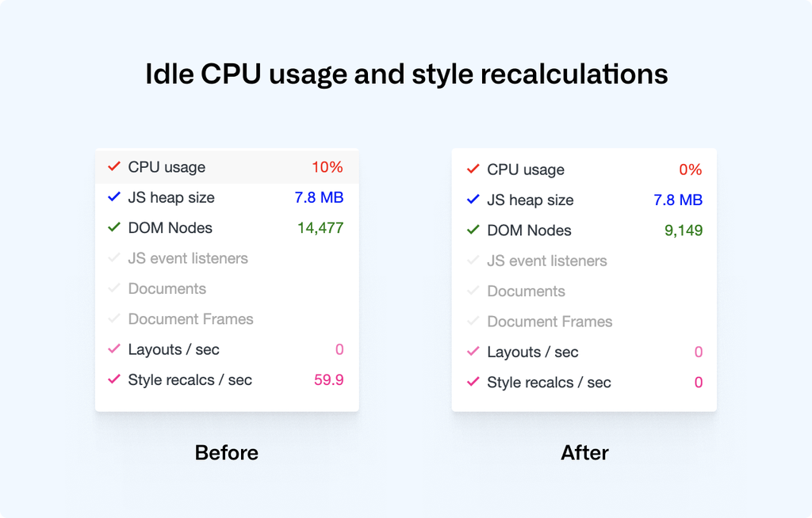

前端爱好者周刊 (Github: shfshanyue/weekly)，每周记录关于前端的开源工具、优秀文章、重大库版本发布记录等等。每周一发布，欢迎订阅


## 一句话


## 开源与库


### **一、 [multiavatar: 自动生成多元化头像](https://multiavatar.com/)**

可根据名称自动生成多元化的头像


+ [repo: multiavatar/Multiavatar](https://github.com/multiavatar/Multiavatar)
+ [npm: @multiavatar/multiavatar](https://npmjs.com/package/undefined)
    

### **二、 [popperjs: 轻量可定制化的 Tooltip 工具库](https://popper.js.org/)**

仅仅只有 3KB 大小，无任何依赖的轻量级 tooltip 工具库，支持 TS，非常流行，每个月有 3500 万次下载。

+ [repo: popperjs/popper-core](https://github.com/popperjs/popper-core)
+ [npm: @popperjs/core](https://npmjs.com/package/undefined)
    

### **三、 [pnpm: 更快、占用空间更小的包管理器](https://github.com/pnpm/pnpm)**

使用 npm、yarn 及 pnpm 下载 React 时的 Benchmark，可见 pnpm 比其它包管理工具要快两倍


从图中，也可以看出 npm v7 性能比 yarn 有更好的性能


+ [repo: pnpm/pnpm](https://github.com/pnpm/pnpm)
+ [npm: pnpm](https://npmjs.com/package/undefined)
    

## 文章推荐


### **一、 [前端优秀实践不完全指南](https://juejin.cn/post/6932647134944886797)**

本文其实应该叫做 **Web 用户体验设计提升指南**。本文罗列的经验大都是在实际开发过程中常会遇到的问题及大厂中变态的细节优化要求，我已经来来回回翻了不下三遍，非常有用，受益匪浅！

1. 图片加载失败后如何处理？
1. 本应 1x1 展示的图片，设计给了 1x100 如何展示？
1. 如何让网站优先加载系统默认字体？
1. 如何做更好的 A11Y 体验优化?


    

### **二、 [为什么现在我更推荐 pnpm 而不是 npm/yarn?](https://juejin.cn/post/6932046455733485575)**

它由 npm/yarn 衍生而来，但是比 npm/yarn 更快，安全性更高，也更好地支持 monorepo。


    

### **三、 [Github 新首页是如何变得更快的](https://github.blog/2021-01-29-making-githubs-new-homepage-fast-and-performant/)**

看惯了教科书式的性能优化方案，来看看这些非教科书式的性能优化方案吧

使用 IntersectionObserver 优化前后的性能对比




    

## 开发利器


## 版本发布


### **一、 [Typescript 4.2 正式发布](https://devblogs.microsoft.com/typescript/announcing-typescript-4-2/)**

TS 作为附有类型的 JS 超集，在周三(02.23)正式发布了 4.2 版本，其中包含了更加智能的别名等新特性，可在链接中打开，并在 Typescript Playground 中提供 DEMO 演示

``` ts
export type BasicPrimitive = number | string | boolean;

// Return: BasicPrimitive | undefined
export function doStuff(value: BasicPrimitive) {
  if (Math.random() < 0.5) {
    return undefined;
  }

  return value;
}
```


    
